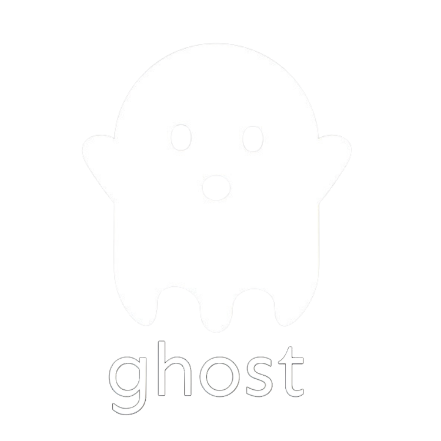

## Privacy Tools Inspired by John McAfee's Vision

ghostX provides privacy-focused tools inspired by John McAfee's vision for digital freedom. This project continues his legacy of fighting for digital privacy, freedom from government surveillance, and individual sovereignty.

> "Internet privacy is a myth. Total anonymity is the only truth." - John McAfee

---

### Features

- **Privacy Atomic Swap**: Exchange crypto assets privately without government interference

- **John McAfee AI Chatbot**: Converse with a digital version of John built on his philosophy

- **Privacy-First Approach**: All tools designed with a no-compromise stance on user privacy

- **Multi-language Support**: Available in English, Spanish, and Portuguese

### Technologies

- Next.js

- TypeScript

- React

- Framer Motion

- Swiper

- YouTube API

- Internationalization (react-intl)

- Tailwind CSS

### Installation and Setup

- Clone the repository

```git clone https://github.com/GhostXByMcafee/ghostx-tech.git```

- Change directory
```cd ghostx-tech```

- Install dependencies
```npm install```

- Run development server
```npm run dev```

The application will be available at http://localhost:3000.

### Requirements

- Node.js 16.x or higher

- npm or yarn

### Environment Setup

- Create a .env.local file in the root directory:

```NEXT_PUBLIC_SITE_URL=https://ghostx.tech```

### Project Structure

Check structure.md file. for the complete directory structure.

### Building for Production

```npm run build```

- Run production server
```npm run start```

### Core Principles

ghostX is built on three fundamental principles inspired by John McAfee:

- **Privacy as a Right**: Digital privacy is not a privilege but a fundamental human right that must be protected.

- **Decentralized Freedom**: Power should be distributed among users, not concentrated in corporations or governments.

- **Open Source Security**: Privacy tools must be transparent, allowing users to verify they work as promised.

### Contributing

Contributions are welcome! Please feel free to submit a Pull Request.

- Fork the repository

- Create your feature branch (git checkout -b feature/amazing-feature)

- Commit your changes (git commit -m 'Add some amazing feature')

- Push to the branch (git push origin feature/amazing-feature)

- Open a Pull Request

### License

This project is licensed under the MIT License - see the LICENSE file for details.

### Acknowledgements

This project is dedicated to the memory of John McAfee, a pioneer in digital freedom and privacy

Thanks to all the developers and privacy advocates who continue the fight for digital sovereignty

---

"In memory of John, with ❤️"